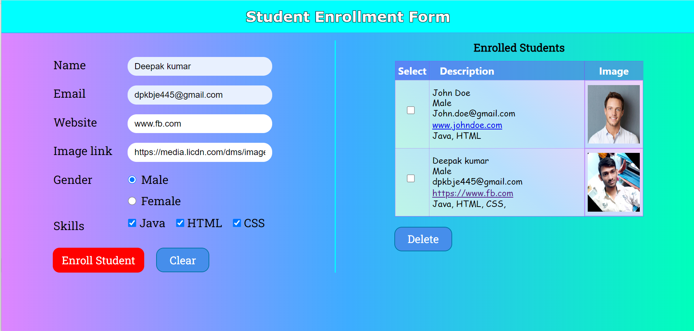

# Frontend Mentor - Registration form solution


## Table of contents

- [Overview](#overview)
  - [Screenshot](#screenshot)
  - [Links](#links)
- [My process](#my-process)
  - [Built with](#built-with)
  - [What I learned](#what-i-learned)
- [Author](#author)

## Overview


### Screenshot




### Links

- Solution URL: (https://github.com/deepak1ok/regd_form.git)
- Live Site URL: (https://regd-form-deepak1ok.netlify.app/)

## My process

### Built with

- Semantic HTML5 markup
- CSS custom properties
- Flexbox
- Mobile-first workflow
- Javasript


### What I learned

To see how you can add code snippets, see below:

```html
<input id="email" placeholder="e.g. example@gmail.com" type="email">
```
```css
  body {
    background-image: linear-gradient(90deg, #bb00ff7a, #0092ffc2, #00ffbc);
  }  
  header h1 {
    text-shadow: -1px -1px 0 black, 1px -1px 0 black, -1px 1px 0 black, 1px 1px 0 black;
  }
```
```js
function validateEmail(email) {
    const res = /^(([^<>()\[\]\\.,;:\s@"]+(\.[^<>()\[\]\\.,;:\s@"]+)*)|(".+"))@((\[[0-9]{1,3}\.[0-9]{1,3}\.[0-9]{1,3}\.[0-9]{1,3}\])|(([a-zA-Z\-0-9]+\.)+[a-zA-Z]{2,}))$/;
    return res.test(String(email).toLowerCase());
}
```


## Author

- Frontend Mentor - (https://www.frontendmentor.io/profile/deepak1ok)
- Twitter - (https://twitter.com/deepak10460)

